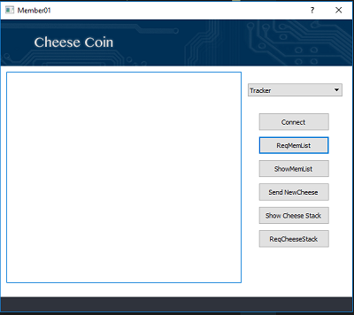

# Cheese Coin Project

The project is about developing a blockchain peer-to-peer system called Cheese Coin. This is a network system which is based on the ideas of Bitcoin but simpler. 
In this system we have implemented the tracker to keep track of other peer-to-peer users in the network, simulating the mining feature with proof-of-work with difficulty of `0000`, and auto-creation of transaction with signature.  


## Getting Started


### Prerequisites

- The blockchain of each member is stocked in a file `.JSON` in the folder `data`.
 You should make sure to have the same blockchain for all members at the beginning to run the test.
 You can download the folder `data` or create it by yourself. 
 - You need to download the files following for the interface:
     ```
    code/clientapp.ui
    code/trackerapp.ui
    code/transactor.ui
    img/bg.png
    img/bgTracker.png
    img/bgTran.png
     ```

### Installing

You need to declare the IP address and port number for `tracker`, `transactor`, and all `members`.
Eg.

```
tracker_address = 'localhost'
member_address = 'localhost'
```

By defaut, the port of members will be :

```
tracker_port = 9999 #Tracker
server_port = 10001 #Member1
server_port = 10002 #Member2
server_port = 10003 #Member3
```


## Running the tests
Execute the files following:
```
code/Clien01_GUI.py
code/Clien02_GUI.py
code/Clien03_GUI.py
code/Tracker.py
code/transactor.py
 ```
### `Tracker` GUI

### `Member` GUI

1. Select `Tracker` in the combobox then click `Connect`.
2. Click `ReqMemberlist` to ask for the Member List.
3. Select `AllClients` in the combobox then click `Connect`.
### `Transactor` GUI

1. Click `ConnectTracker` then Click `getMemberlist` to get IP address of all members.
2. Click `Connect Clients`.
3. Start sending transactions by clicking `Start Sending`.
By default, one transaction will be released every 5 seconds.

## System Structure


## Contributors

* [Tuan-Anh TRAN](https://github.com/trantuananhvn93) 
* [Tu-My DOAN](https://github.com/doantumy) 
* [Na WANG]() 

## Contributing

Please read [protocol.md](https://github.com/UJM-INFO/2018-net-f/blob/master/protocol.md) for details on our code of conduct.

## Project Poster

