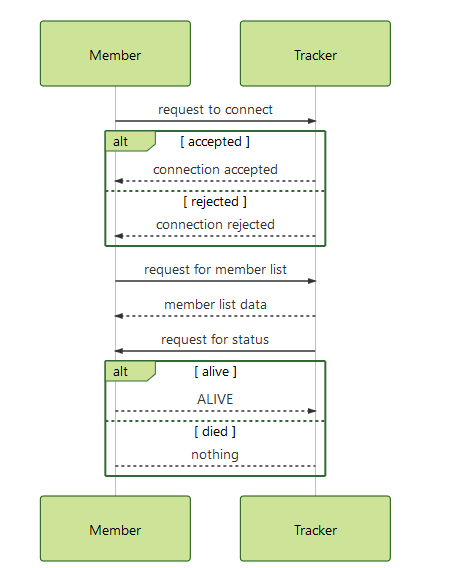

# Blockchain P2P Processes

1. New transactions are broadcast to all members, all transactions will be contained in a queue FIFO.
2. Each member collects new transactions into a `Cheese` (max 5 transactions for 1 `Cheese`).
3. Each member works on finding a difficult proof-of-work for its `Cheese`.
4. When a member finds a proof-of-work, it broadcasts the `New_Cheese` to all members.
5. Members accept the `New_Cheese` only if all transactions in it are valid and not already spent.
6. Members express their acceptance of the `Cheese` by working on creating the next `Cheese` in the chain, using the hash of the accepted `Cheese` as the previous hash and deleting processed transactions in the queue. 


## Cheese structure
Each `Cheese` has an `index`, a `time_stamp`, a list of `transactions`, a `nonce`,  a `smell` of previous `Cheese` and its proper `smell` (a hash computed from all listed information by using *SHA1*). E.g
```json
{
  "index": 2,
  "timestamp": "2018-02-1 11:23:10.140996",
  "transactions": [
      {
        "from": "Satoshi team",
        "to": "UJM",
        "amount": 3
      },
      {        
        "from": "Na",
        "to": "Anh",
        "amount": 30
      }
    ],
  "previous_smell": "0023dd3ef6af2e7eb8272245cb8ea91b4ecfc3e60af22d8518ef0bba8b4a6b22",
  "nonce": 36,
  "smell": "001edd3ef6af2e7eb8272245cb8ea91b4ecfc3e60af22d8518ef0bba8b4a6b18"
  
}
```
For `BlueCheese`- the original cheese - it is defined nearly the same with normal cheese except that there is no previous `smell`, `index` is `0` and a predefined `content`.

## Transaction format
Each transaction will be a JSON object detailing the sender of the coin, the receiver of the coin,the amount of CheeseCoin that is being transferred, a signature computed by a message and the private key of the sender, miner information, and reward for the miner, e.g
```json
{"index": 5, 
"timestamp": "2018-03-03 21:38:33.904931", 
"transactions": 
[{
"from":"18d55fc7da4281a0ef909864d8482c7c9985ec91bad34f93cb4886e5eab09bc4878fff0f37e47dc9dfdc0a3c321dfa8068ca79e664a190990ebea6006a063d43", 
"to":"27fc884268b79bcb8ac1535a635c327fe17570fea51628fce4531a2cdbb867e4b23775dcff96b18d1b9194229aab3c793f3e66411d1ed588d9676aa367f231bb", 
"amount": 10, 
"signature":"b0b03bda3ca5be9893494bf65786c220eabb8242bbd27971d539f4ece2940625868390c44e3acddaa16466377c13381fe631dcdbffa8becfd8426512b2bc1424", 
"miner": "Member01", 
"reward": 1
}], 
"previous_smell": "0bc736a89e197abae7b1ef2163941f6309ac195b", 
"nonce": 54127, 
"smell": "00006b96d6d11cce4739e8dd8344508b7287db95"}
```

## Cheese mining
When new transactions are broadcast in the network, **member**s will collect all of them to put every 3 transactions into a single `Cheese`. They will verify the transaction (based on digital signatures and public keys). They will then try to solve the proof-of-work problem by finding a `nonce` to generate a hash string (`smell`) that begins with at least two `0`. If miner successfully found it,  he will approve the `Cheese`, add it to the longest chain he has and send this new mined `Cheese` to all over the network. The reward for the miner will be added to the transaction inside the new block.

Newly mined `Cheese` will be confirmed by checking the information of the previous block and itself. **Member**s in the network should accept the new `Cheese` right away.

## Synchronization
The following rules are used to keep the network in sync.
- When a member generates a new `Cheese`, he broadcasts it to the network.
- When a member connects to a new peer he queries for the latest `Cheese`.
- When a member encounters a `Cheese` that has an index larger than the current known `Cheese`,  he either adds the `New_Cheese` to his current `Cheese_Stack` or queries for the full `Cheese_Stack`.


## Validation
At any given time we must be able to validate if a `Cheese` or a `Cheese_Stack` are valid in terms of integrity. This is true especially when we receive new `Cheeses` from other members and must decide whether to accept them or not.

The algorithm must check :
 - if the `index` of `New_Cheese` is correct?
 - if the `previous_smell` is correct?
 - compute the hash from data and compare it with the current `smell`.
 

# Sequence Diagrams of P2P network

## Tracker & Member 



## Member & Member 

### Establish connection


### Exchange parts (cheese stack) & Update cheese stack


### Inform the others new mined cheese

#### Ask cheese(s) from other member(s)

### Member connection and syncs

### Member broadcasting

# Message structure
## Interactions between Members and Tracker
| Event | Request Message | Response Message | Description |
|---|---|---|---|
| Establish connection between **Member** and **Tracker** |`REQ_CONNECT`  |`0x01-MESSAGE` |**Member** in the network sends request to connect to the **Tracker**. The **Tracker** returns the message with connection status.|
| Ask for member list from the **Tracker** | `0x02-REQ_MEM_LIST` |`0x02-MEM_LIST`|**Member** in the network can ask for member list from the **Tracker**, requested **Tracker** will send back a sub-part of the list (`MEM_LIST`) containing members in the form of text. `MEM_LIST` will be defined as a list: `IP Address:Port`;`IP Address:Port` .|
| Update member status | `0x03-REQ_ALIVE` | `0x03-ALIVE` or nothing| The **Tracker** might sometimes check for the status of its **Member**. if the **Member** is not alive, it should be deleted from the member list of the **Tracker**|

## Interactions among Members

| Event | Request Message | Response Message | Description |
|---|---|---|---|
| Establish connection to other member(s) |`REQ_CONNECT`  |`0x04-MESSAGE`|Member in the network sends request to connect to other member(s) in the net work. The requested member returns the message with connection status.|
| Exchange parts (cheese stack) among members | `0x05-REQ_CS_LENGTH` and `0x05-REQ_CS`  |`0x05-0x01-CHEESE_STACK_LENGTH` and `0x05-0x02-CHEESE_STACK`|Members in the network may send request to ask for cheese stack from the others. They will ask for the length of `CHEESE_STACK` first, if it's longer than theirs, they will ask for the update, in return they will receive blocks they don't have. 
The received list will be defined as in followed format: `IndexNumber,TimeStamp,TransactionDetails(sender,recipient,amount),ParentSmell,Nonce,Smell`;`IndexNumber,TimeStamp,TransactionDetails(sender,recipient,amount),ParentSmell,Nonce,Smell`. The length of the list depends on how many blocks they need to update.|
| Inform the others new mined cheese | `0x07-NEW_CHEESE` |`0x07-NEW_CHEESE_VALID` or `0x07-NEW_CHEESE_INVALID`| When a member successfully mined a new cheese block, he will broadcast this to the network. Other members will check for the validity of the new block and send back the response to the miner and update their copy of the chain if new block is considered valid.|

